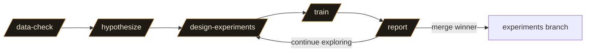
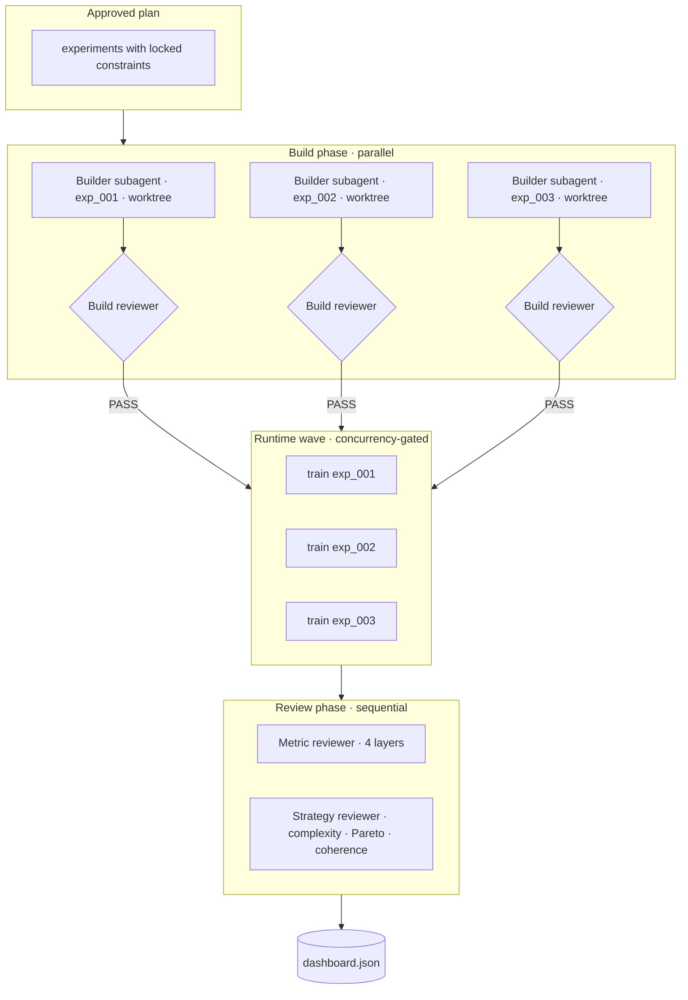
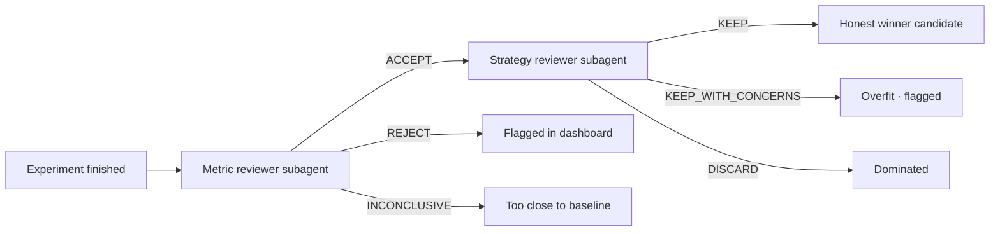

# Model Trainer

A Claude Code plugin for autonomous, supervised-learning model training. It is designed so that someone learning ML can follow every decision the model makes, and so that someone who has been doing this for years can trust the evidence behind it.

> **Status:** 0.1.0 · MIT licensed · first open-sourced skill in this series.

---

## Why this exists

I was running an AI booth one afternoon when someone came up to tell me they were planning to use Claude to help them build their own model. I could see immediately where Claude would be useful to them: scaffolding the architecture, writing the loops, explaining the maths. I could also see the shape of the gap. Building a model well is not the same as writing a neural network. It is about knowing the questions to ask of your data, the patterns that repeat across experiments, and the thinking that distinguishes a model that happens to fit your training set from one that will hold up when it sees the world.

That is work Claude can help with, but only if the workflow around it is rigorous. So I built this. It is the first of my skills I am open-sourcing, and I wanted it to be a fair example of what a proper skill, and a proper skill-driven workflow, should look like.

The goal is simple: give people a principled path from a raw dataset to a model they can actually trust, with every intermediate judgement either executed as code or gated behind a fresh reviewer. Along the way, the plugin teaches the terminology and the disciplines by speaking in plain language and defining every term the first time it appears.

---

## The workflow at a glance



Each stage is its own skill. Each one must finish before the next begins. Humans approve at three gates: the hypothesis, the experiment plan, and the post-batch report.

| Command | What it is really doing |
|---|---|
| `/data-check` | Sourcing the data, confirming the path and target with you, running eight universal quality checks, mitigating what it can, and locking the post-mitigation variables. |
| `/hypothesize` | Agreeing on the architecture direction, the split strategy, the feature whitelist, and what "better" actually means, recorded in an integrity block with a SHA-256 sidecar. |
| `/design-experiments` | Planning the batch, spawning three research agents in parallel, setting up git worktrees, and getting a fresh reviewer subagent to sign off before anything trains. |
| `/train` | Building experiments in isolated worktrees, reviewing each build, running the wave, and writing results back into the plan file. No numerical interpretation happens here. |
| `/report` | Dispatching two reviewer waves (metrics first, then strategy), rendering the X-Ray dashboard, and presenting a plain-language recommendation you can act on. |

---

## Why this workflow, in more detail

### Data understanding comes before anything else

People skip this. They shouldn't. `/data-check` will not proceed to the next stage until you have confirmed the path, the format, and the target. It then runs eight executed checks (shape, types, missing values, target, duplicates, distributions, correlations, outliers) and dispatches a specialist subagent to mitigate anything that fails. The mitigations are recorded, and from that moment forward the pipeline treats the post-mitigation variables as locked. If you transformed the target with a log, the hypothesis stage will not let you regress on the raw one.

### Hypothesising is about direction, not certainty

This is the part I care about most. The first model you train is never the best model you will train. What the hypothesis stage is really asking is: *given what we saw in the data, what direction should we pull in, and what would we need to see in order to believe we have pulled in the right one?* Success is defined relative to baselines that will be computed during training, not against numbers you wish you could hit. The hypothesis becomes a tamper-evident contract: split strategy, feature whitelist, architecture bounds, generalisation-gap limit, metric names. Change any of them and the downstream SHA-256 hash breaks.

### Training is a search, not a single shot



The point of training many versions in parallel is not to find the one lowest number. It is to surface the rules that your dataset is actually following. Running three linear baselines and three gradient-boosted variants in the same batch tells you far more than running a single clever model would. Sometimes the highest training accuracy is an overfit that collapses on unseen data. Sometimes the humblest architecture is the one that generalises. You only see this by running the experiments side by side, on the same split, under the same locked constraints, and comparing them on evidence you did not eyeball.

Each builder runs inside its own git worktree at `.model-trainer/worktrees/<batch-NN>/<exp-id>/`. Worktrees provide structural isolation: a builder cannot corrupt the parent branch, cannot read across other experiments, and cannot silently mutate earlier work. Winners get merged to `model-trainer/experiments` with a promoted tag; non-winners remain on their branches so you can come back to them later. The audit trail is not optional.

### The reviewer pipeline exists because you should not trust a single verdict



No agent both produces and approves its own work. That is the single most load-bearing rule in the plugin. The metric reviewer runs four layers of defence: manifest validation, overfitting detection by train/validation gap ratio, significance testing against the practical threshold you defined, and forensic checks for NaNs, spikes, and mode collapse. Only after it returns `ACCEPT` does the strategy reviewer run: complexity scoring, Pareto dominance, and detection of stale hyperparameter-only tuning. Research consistently shows roughly 94% of variance is architecture and 6% is hyperparameters, so if the last three experiments all tuned the 6%, the reviewer will tell you. Both reviewers execute Python scripts for every numerical comparison. Neither is allowed to look at a number and decide.

### Execute, do not eyeball

This is the discipline I am proudest of. Large language models are genuinely bad at arithmetic when the numbers get close together. `0.0495` and `0.0523` look the same to a tired reader and to an LLM. They are not the same. One is six per cent better than the other. The plugin refuses to let Claude make that judgement directly. Every metric comparison, every complexity ratio, every gap calculation is written as a script, executed, and parsed back from JSON. The model composes the script because composing scripts is something language models do well. The computer runs the script because running scripts is something computers do well. Nobody pretends otherwise.

The corresponding rule for the prompts themselves is to prefer imperative instructions over examples. Examples seed hallucinations. A model given an example of a good hypothesis will tend to reproduce its shape, which means the hypothesis starts being about the example rather than about the data. Imperative instructions with gate functions, such as *"Did you execute a script, or are you eyeballing?"* or *"Does the split strategy match the data structure?"*, force mechanical verification instead.

### Reporting is the conversation at the end

`/report` produces two things. The first is a structured `dashboard.json` that conforms to a strict schema. The second is an X-Ray dashboard rendered from it, served from a Node.js process on a random high port, with WebSocket-driven live reload when the JSON changes. The dashboard is presence-driven: every section appears only when the batch produced data for it. Learning curves appear if experiments declared per-epoch history. A Pareto scatter appears if two or more experiments are comparable. An HP-importance bar appears only if you actually varied architecture against hyperparameters.

Verdicts are never surfaced in their raw form. `ACCEPT + KEEP` becomes "honest winner". `ACCEPT + KEEP_WITH_CONCERNS` becomes "overfit · flagged". `BLOCKED_TAMPER` becomes "tamper detected". The mapping is pure, deterministic, and baked into the renderer, so the language stays honest as the codebase grows.

---

## Installing the plugin

The plugin ships as a Claude Code plugin with a marketplace manifest at the repository root. You add the marketplace, then install the plugin from it.

### From GitHub (recommended)

Run these inside Claude Code:

```
/plugin marketplace add Hook12aaa/model-trainer
/plugin install model-trainer@model-trainer
```

Pin to a specific branch or tag with `@ref` if you want a frozen version:

```
/plugin marketplace add Hook12aaa/model-trainer@master
```

### From a local clone

Useful if you are developing against the plugin directly:

```
git clone https://github.com/Hook12aaa/model-trainer.git
/plugin marketplace add /path/to/model-trainer
/plugin install model-trainer@model-trainer
```

If the path contains spaces, quote it or symlink to a space-free location:

```bash
ln -s "/path/with spaces/model-trainer" ~/model-trainer-dev
/plugin marketplace add ~/model-trainer-dev
```

### After install

The `SessionStart` hook bootstraps the plugin automatically. The `using-model-trainer` skill is injected into every new session and lists the five commands above. You do not need to invoke it manually.

### Prerequisites

| Requirement | Why |
|---|---|
| **Git repository** | `/train` uses git worktrees for builder isolation. There is a hard gate: if `git rev-parse --git-dir` fails, the skill stops and asks whether to run `git init`. |
| **Python in `PATH`** | All numerical work (data checks, reviewer comparisons, training itself) runs through executed Python scripts. The plugin does not pin a version. |
| **Your framework of choice** | Bring whichever ML library fits the problem. The plugin is framework-agnostic; `/design-experiments` will pick up what is available in the environment. |
| **A dataset you have read** | Not a prerequisite so much as a temperament. The plugin will be more useful to you if you have at least glanced at the data before starting. |

No custom runtime, no Python engine, no daemon. The plugin is markdown and YAML. Claude Code is the runtime.

---

## Repository layout

```
.
├── .claude-plugin/        # plugin manifest + local marketplace
├── commands/              # slash command stubs
├── hooks/                 # SessionStart bootstrap
├── skills/
│   ├── using-model-trainer/   # session-start introduction
│   ├── data-check/            # data validation + mitigation
│   ├── hypothesize/           # architecture, metrics, integrity block
│   ├── design-experiments/    # batch planning + worktree setup
│   ├── train/                 # builder/runtime/handoff phases
│   ├── review-metrics/        # 4-layer metric verdict subagent
│   ├── review-strategy/       # complexity · Pareto · coherence subagent
│   └── report/                # dashboard + recommendation
├── docs/                  # design specs, plans, historical notes
├── CLAUDE.md              # project instructions
└── README.md
```

The two review skills share a `references/execute-dont-eyeball.md` file. The copies are intentionally byte-identical and `diff`-checked on every edit. See `CLAUDE.md` for the rationale.

---

## Design principles

These are the ideas the plugin is built on. If you are reading the code or thinking of contributing, these are the load-bearing ones.

1. **Execute, do not eyeball.** Every numerical comparison is a script. LLMs are bad at maths in the small; scripts are not.
2. **Structural distrust.** No agent reviews its own output. Builders are reviewed. Metrics are reviewed. Strategies are reviewed. The hypothesis is reviewed.
3. **Imperatives over examples.** The prompts tell the model what to do, not what the output should look like. Examples seed hallucination.
4. **Tamper-evident integrity.** Hypothesis constraints live in a delimited block with a SHA-256 sidecar. The plan inherits the hash. The training pipeline stops if either drifts.
5. **Presence-driven rendering.** If the data for a dashboard section does not exist, the section does not exist. The UI never shows empty frames.
6. **Plain language throughout.** Every user-facing string is written for someone learning ML. No third-person self-reference to "the skill". No jargon without a definition.
7. **Status as a formal vocabulary.** Every skill emits one of `DONE`, `DONE_WITH_CONCERNS`, `BLOCKED`, or `NEEDS_CONTEXT`. Experiment outcomes use a similar ternary contract. There is no "looks good".

---

## Inspirations

I built this after learning from a few places that handle skill-driven workflows well:

- **Superpowers.** The originator, in my view, of this genre of Claude skill: rigorous, TDD-first, review-gated, with an actual vocabulary for how skills should interact. It sets the bar I have been trying to live up to.
- **Autonomous training frameworks.** The general idea that training is a search over experiments, not a single run, owes a great deal to AutoML and AutoTrain lineages.

What I wanted to do differently was put the full loop together end to end, from raw data to a dashboard a non-expert can read, and bake the disciplines I care about most (execution over estimation, structural distrust, tamper-evident integrity) into the prompts rather than leaving them to the user to remember.

---

## Contributing

This is an open invitation. If you have a better way of handling one of the stages, a reviewer layer the current pipeline is missing, or a skill pattern that improves on what is here, I would like to see it. File an issue with the behaviour you want to change and why, or open a pull request with the change already implemented against a dedicated branch.

A few guidelines to save time in review:

- Skills should stay self-contained. If you introduce shared references, document the duplication policy in `CLAUDE.md`.
- Anything numerical must go through a script. If you find yourself writing `if metric_a > metric_b` inline in a skill, that is the signal to extract it.
- Keep the voice plain. No third-person self-reference. Define every term on first use.
- New skills follow the existing anatomy: Core Principle, Gate Functions, Rationalisation Table, Red Flags, Bottom Line.

---

## Licence

MIT. Use it, fork it, build on it. Attribution is welcome but not required.
