# Data Check

## Core Principle

No data without a quality check. No quality check without executing a script and reading the saved report.

## Process Flow

```dot
digraph data_check {
    rankdir=TB;

    "User starts ML project" [shape=doublecircle];
    "Has data?" [shape=diamond];
    "User supplies path" [shape=box];
    "Confirm path, format,\nand target with user" [shape=box];
    "Search online?" [shape=diamond];
    "Search datasets\n(read references/online-sourcing-guide.md)" [shape=box];
    "Evaluate before download\n(size, recency, license, docs)" [shape=box];
    "Found suitable?" [shape=diamond];
    "Download & source" [shape=box];
    "Produce data\nrequirements doc" [shape=box];
    "BLOCKED:\nuser must find data" [shape=box];

    "DATA SOURCED" [shape=box];

    "Spawn QUALITY REVIEWER\n(fresh subagent)" [shape=box];
    "Run 8 universal checks\n(JSON report to FILE)" [shape=box];
    "Read report file\n(NOT console)" [shape=box];
    "All checks PASS?" [shape=diamond];

    "Auto-detect problem type\nfrom target variable" [shape=box];
    "Confirm type with user" [shape=box];
    "Dispatch type-specific\nreview subagent\n(read matching reference doc)" [shape=box];
    "Type checks PASS?" [shape=diamond];

    "Spawn MITIGATION agent\n(fresh subagent)" [shape=box];
    "Fix issues" [shape=box];
    "Run verification command\n(expect specific output)" [shape=box];
    "Verified fixed?" [shape=diamond];

    "DONE: proceed to\n/hypothesize" [shape=doublecircle];

    "User starts ML project" -> "Has data?";
    "Has data?" -> "User supplies path" [label="yes"];
    "Has data?" -> "Search online?" [label="no"];
    "User supplies path" -> "Confirm path, format,\nand target with user";
    "Confirm path, format,\nand target with user" -> "DATA SOURCED";
    "Search online?" -> "Search datasets\n(read references/online-sourcing-guide.md)" [label="yes"];
    "Search online?" -> "Produce data\nrequirements doc" [label="no"];
    "Search datasets\n(read references/online-sourcing-guide.md)" -> "Evaluate before download\n(size, recency, license, docs)";
    "Evaluate before download\n(size, recency, license, docs)" -> "Found suitable?";
    "Found suitable?" -> "Download & source" [label="yes"];
    "Found suitable?" -> "Produce data\nrequirements doc" [label="no"];
    "Download & source" -> "DATA SOURCED";
    "Produce data\nrequirements doc" -> "BLOCKED:\nuser must find data";

    "DATA SOURCED" -> "Spawn QUALITY REVIEWER\n(fresh subagent)";
    "Spawn QUALITY REVIEWER\n(fresh subagent)" -> "Run 8 universal checks\n(JSON report to FILE)";
    "Run 8 universal checks\n(JSON report to FILE)" -> "Read report file\n(NOT console)";
    "Read report file\n(NOT console)" -> "All checks PASS?";
    "All checks PASS?" -> "Auto-detect problem type\nfrom target variable" [label="PASS"];
    "All checks PASS?" -> "Spawn MITIGATION agent\n(fresh subagent)" [label="FAIL"];

    "Auto-detect problem type\nfrom target variable" -> "Confirm type with user";
    "Confirm type with user" -> "Dispatch type-specific\nreview subagent\n(read matching reference doc)";
    "Dispatch type-specific\nreview subagent\n(read matching reference doc)" -> "Type checks PASS?";
    "Type checks PASS?" -> "DONE: proceed to\n/hypothesize" [label="PASS"];
    "Type checks PASS?" -> "Spawn MITIGATION agent\n(fresh subagent)" [label="FAIL"];

    "Spawn MITIGATION agent\n(fresh subagent)" -> "Fix issues";
    "Fix issues" -> "Run verification command\n(expect specific output)";
    "Run verification command\n(expect specific output)" -> "Verified fixed?";
    "Verified fixed?" -> "Spawn QUALITY REVIEWER\n(fresh subagent)" [label="yes (re-review)"];
    "Verified fixed?" -> "BLOCKED:\nuser must find data" [label="no (unfixable)"];
}
```

## Checklist

1. Determine data source (user has it, can search online, needs help)
2. Source the data and confirm path, format, and target with the user before loading
3. Spawn a fresh quality reviewer subagent for universal checks
4. Read the structured JSON report from file — never from console output
5. Auto-detect problem type from the target variable, confirm with user
6. Dispatch a type-specific review subagent with the matching reference doc
7. If any check fails: spawn a mitigation agent, verify the fix, re-review with a fresh quality reviewer
8. Save the final data quality report to `docs/model-trainer/data-quality-report.json`

## Sourcing Data

### Path 1: User Has Data

State the exact path, expected format, and expected contents back to the user. Wait for explicit confirmation before loading. Do not narrate the confirmation step itself — just perform it.

Supported formats: CSV (auto-detect delimiter), JSON, JSONL, Parquet, XLSX, directory of files (images, text), database connection.

### Path 2: Data Obtainable

Produce a data requirements document and save it to project docs. Use industry-standard specification format:

- Required fields with types
- Minimum sample size: 10-20x feature count
- Target variable name and type
- Quality standards (max missing %, expected distributions)
- Delivery format and path

Status after producing the document: BLOCKED. The user must obtain the data and return.

### Path 3: Online Search

Read `references/online-sourcing-guide.md` first. Run `date` to get the current date for recency comparison. Evaluate candidate datasets against trustworthiness tiers, documentation requirements, license compatibility, and recency standards. Present the evaluation to the user. Confirm before downloading.

## Universal Quality Checks

Spawn a fresh quality reviewer subagent. The subagent writes and executes a single script covering all 8 checks. Results saved to `docs/model-trainer/data-quality-report.json`. The subagent reads the saved file to interpret results — never console output.

All numeric thresholds below are declared in `references/quality-thresholds.md` with their rationale, and may be overridden per-project via `docs/model-trainer/data-quality-config.json`. The reviewer subagent resolves each threshold by reading the config file first, then falling back to the reference. The effective value and its source (`config` or `reference`) are recorded per check in `data-quality-report.json`. No threshold is inlined in the subagent's code; the reviewer reads both paths before emitting any verdict.

1. **Shape & Size** — Report rows, columns. Fail if rows below `min_rows`. Warn if samples/features ratio below `min_samples_per_feature`.
2. **Data Types** — Report dtype per column. Flag if coercion-failure rate exceeds the declared per-column ceiling. Flag if any column's cardinality equals row count (likely ID).
3. **Missing Values** — Report per-column missing %. Apply the four-band policy (simple-impute / advanced-impute / indicator / drop) using the declared bands.
4. **Target Variable** — Must exist, correct type, missing fraction at or below `target_missing_max`, non-zero variance.
5. **Duplicates** — Exact-duplicate-row fraction above `duplicate_row_warn` → flag. Any duplicate IDs → fail.
6. **Distributions** — |Skewness| above `skew_abs_max` → recommend transform. Zero-variance columns → drop. Modal-value fraction above `near_constant_max` → drop.
7. **Correlations** — Feature-feature |r| above `feature_redundancy_threshold` → flag redundancy. Feature-target |r| above `feature_target_leakage_threshold` → leakage, fail. VIF above `vif_max` → fail.
8. **Outliers** — Modified Z-score (MAD-based) above `mad_z_threshold` → flag. Per-column outlier fraction above `outlier_fraction_investigate` → investigate root cause before removal.

## Report Schema

The quality reviewer subagent writes the report JSON to `docs/model-trainer/data-quality-report.json` with this exact shape. Downstream skills assert against this schema.

    {
      "overall_status": "PASS | FAIL",
      "timestamp": "<ISO-8601>",
      "dataset_path": "<string>",
      "checks": {
        "shape_size":       {"status": "PASS | WARN | FAIL", "details": <object>},
        "data_types":       {"status": "PASS | WARN | FAIL", "details": <object>},
        "missing_values":   {"status": "PASS | WARN | FAIL", "details": <object>},
        "target_variable":  {"status": "PASS | WARN | FAIL", "details": <object>},
        "duplicates":       {"status": "PASS | WARN | FAIL", "details": <object>},
        "distributions":    {"status": "PASS | WARN | FAIL", "details": <object>},
        "correlations":     {"status": "PASS | WARN | FAIL", "details": <object>},
        "outliers":         {"status": "PASS | WARN | FAIL", "details": <object>}
      },
      "type_detected": "regression | classification | computer_vision | time_series | nlp",
      "mitigations_applied": ["<string>", ...]
    }

`overall_status` is `PASS` only when every `checks.*.status` is `PASS` or `WARN`. Any single `FAIL` in `checks` promotes `overall_status` to `FAIL`.

## Type Detection and Dispatch

Auto-detect problem type from the target variable:

- Continuous numeric target --> regression. Read `references/regression-data.md`.
- Categorical or discrete target --> classification. Read `references/classification-data.md`.
- Directory of image files --> computer vision. Read `references/computer-vision-data.md`.
- Datetime index with ordered observations --> time series. Read `references/time-series-data.md`.
- Text column as primary feature --> NLP. Read `references/nlp-data.md`.

Confirm the detected type with the user before dispatching. Spawn a dedicated type-specific review subagent that reads the matching reference doc and runs type-specific checks.

## Mitigation Sub-Process

When any check fails, spawn a dedicated mitigation agent (fresh subagent). The mitigation agent:

1. Fixes the identified issues
2. Runs a verification command that produces specific expected output
3. Hands off to a fresh quality reviewer subagent for re-review

The mitigation agent and the re-review agent must be separate subagents. If the issue is unfixable, status is BLOCKED and the user must find alternative data.

## Gate Functions

BEFORE saying data is ready: "Did I execute a quality script, or am I eyeballing `.head()`?"

BEFORE proceeding to hypothesize: "Did every check pass, or am I ignoring failures?"

BEFORE accepting the user's claim that data is clean: "Did I verify independently, or am I trusting the user's claim?"

## Rationalization Table

| You think... | Reality |
|---|---|
| "The data looks fine from the first few rows" | You are eyeballing. Execute the quality script. |
| "We can clean it up during training" | Garbage in, garbage out. Clean it first. No exceptions. |
| "It's a small dataset, quality doesn't matter as much" | Small datasets are MORE sensitive to quality issues, not less. |
| "The user said the data is clean" | Verify independently. Structural distrust applies to data claims. |
| "I'll just check the shape and move on" | Shape is 1 of 8 checks. Run ALL of them. |
| "This is a well-known public dataset, it's already clean" | Public datasets have known issues. Verify anyway. |

## Red Flags

- "The data looks good"
- "I checked `.head()` and it seems fine"
- "The user confirmed it's clean"
- "We can handle missing values later"
- Any sentence containing "seems", "looks", or "appears" about data quality

## Bottom Line

Write and execute a script that loads `docs/model-trainer/data-quality-report.json` and asserts `overall_status` is `PASS`. Print `DATA CHECK: PASS` or `DATA CHECK: FAIL` with the specific failing check name. No data proceeds without a PASS.
