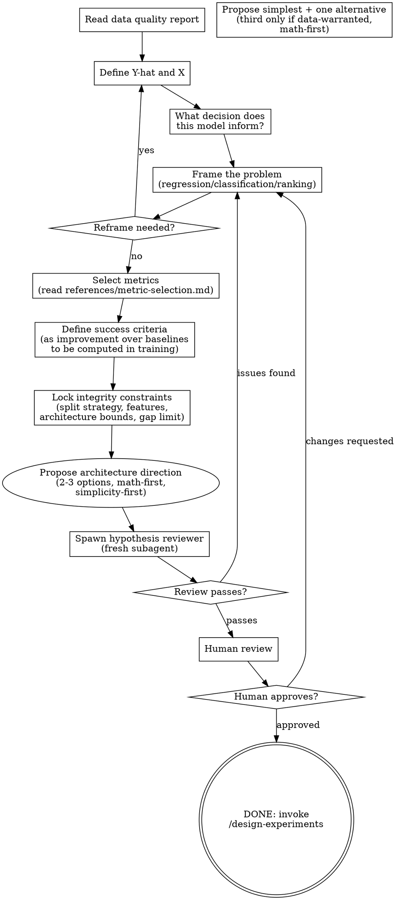

# Hypothesize

<HARD-GATE>
Do NOT hypothesize without a data-check PASS report. If no data quality report exists, STOP and invoke data-check. The hypothesis must be grounded in actual data characteristics, not assumptions.
</HARD-GATE>

<HARD-GATE>
Do NOT define success criteria without specifying which baselines will be computed in the first experiments. Every target must be defined as improvement over a baseline, not as an absolute number. No hallucinated targets.
</HARD-GATE>

## Anti-Pattern

**"This Problem Is Too Simple To Need A Hypothesis"** -- every ML project gets a hypothesis. A linear regression on 3 features still needs defined Y-hat, metric, baseline definition, split strategy, and success criteria. Simple problems are where unexamined assumptions cause the most wasted compute.

## Core Principle

Three responsibilities, all mandatory:

1. **Problem clarity** -- define Y-hat and X, understand the decision the model informs, frame the problem type.
2. **Success definition** -- select the right metric, define success as improvement over baselines (computed later during training), set integrity metrics alongside performance metrics.
3. **Integrity protection** -- lock train/val/test split strategy, declare available features, set architecture bounds, define generalization gap constraints. The training agent cannot change these.

## Process Flow

The hypothesis process is a graph with legitimate backtracking, not a linear pipeline.

## Checklist

The agent MUST complete these in order (backtracking is allowed). Create tasks for tracking.

1. Read the data quality report from data-check
2. Define Y-hat (target) and X (features) -- ask the user
3. Understand the decision context -- what action does the prediction trigger?
4. Frame the problem type (read references/problem-framing.md)
5. Select metrics (read references/metric-selection.md) -- primary, secondary, integrity
6. Define success criteria as improvement over baselines to be computed in first experiments
7. Lock integrity constraints (split strategy, feature declarations, architecture bounds, generalization gap)
8. Propose the simplest viable architecture plus one meaningful alternative. Add a third option only when data characteristics warrant it.
9. Spawn hypothesis reviewer subagent (fresh agent, structural distrust)
10. Present to human for approval
11. Save hypothesis document with the Integrity Block delimited region
12. Emit the SHA-256 sidecar for the Integrity Block
13. Invoke /design-experiments

## Step Details

### 1. Read Data Quality Report

Before asking any questions, read the data-check output. The hypothesis must be grounded in actual data characteristics: sample count, feature count, data types, class balance, quality issues found. Do not hypothesize in a vacuum.

### 2. Define Y-hat and X

Read `mitigations_applied` from the data-quality report. For every transform it records — whether on the target or on any feature (log-transform, Box-Cox, winsorization, relabeling, row drops) — treat the post-mitigation variable as locked. State the inherited variables to the user and ask for confirmation. Do not offer pre-mitigation variables as an option. Do not treat any mitigation as reversible at this step.

Ask the user one question at a time (multiple choice preferred):

- Confirm the inherited target and feature set (or declare them, if no mitigation applied).
- Are all features available at inference time? (drop any that are not)
- Are there features that encode or derive from the target? (these must be excluded)
- Do you want engineered features on top of the inherited set? (optional, user-proposed only)

### 3. Decision Context

Ask: "What decision does this model inform?" The answer determines problem framing:

- Threshold-based action (approve/deny, flag/pass) --> classification
- Arithmetic use of prediction (pricing, forecasting) --> regression
- Ordering items (recommendations, search results) --> ranking
- Cost-asymmetric decisions (fraud, medical) --> weighted loss

### 4. Problem Framing

Read `references/problem-framing.md`. Common misframings to catch:

- Binning a continuous target into categories when the consumer needs a number
- Classification when ranking is the real need
- Regression when the distribution is multimodal
- Ignoring cost asymmetry (false positive vs false negative have different costs)

If the framing feels wrong after examining these, loop back to step 2.

### 5. Metric Selection

Read `references/metric-selection.md`. The metric must be the mathematical proxy of the business cost function:

- Select primary metric driven by the decision context
- Select secondary metrics for supporting evidence
- Select integrity metrics: generalization gap (train vs val difference), parameter efficiency
- Check if the "obvious" metric is wrong for this data (accuracy on imbalanced data, MSE with outliers, R-squared across datasets)

### 6. Success Criteria

Define success as improvement over baselines. Baselines are NOT computed here -- they are computed as the first experiments during training. The hypothesis defines:

- What baselines to compute (naive predictor, linear model, domain reference)
- That the target is "meaningful improvement over the best baseline"
- What "meaningful" means in the domain context (the human helps define this)

No absolute target numbers unless they come from hard domain requirements like a regulatory floor or a contractual recall threshold -- those are business constraints, not computed baselines.

### 7. Integrity Constraints (Locked, Immutable During Training)

**Data split strategy:**
- Train/val/test ratios declared here
- Stratification method declared here (stratified, temporal, grouped)
- The training agent cannot change this

**Feature declarations:**
- Which features are available at inference time -- listed here
- Features excluded (target-derived, future-looking) -- listed here
- The training agent cannot add undeclared features

**Architecture bounds:**
- Maximum complexity rung to start on the simplicity ladder
- Maximum parameter count (derived from data size and discovered hardware)
- The training agent must start simple

**Generalization gap bound:**
- Maximum acceptable difference between train and val metrics
- The review-metrics skill checks this, but the bound is defined here

### 8. Propose Architecture Direction

Propose the simplest viable architecture plus one meaningful alternative. Add a third option only when data characteristics justify it — multimodal target, strong spatial or temporal structure, mixed scales that defeat linear models, or an interaction pattern the first two cannot capture. Never add a third option to meet a count.

For each option:

- Name the loss function, optimizer family, and architectural principle before naming any library.
- State a data-specific reason the option would meaningfully beat the previous rung. Generic reasons like "bridges different parts of the ML spectrum" or "covers another class of model" are not reasons — drop the option.
- Reference the data quality report for feasibility (sample count versus model complexity).

Ask one question at a time. The user chooses.

### 9. Hypothesis Reviewer (Subagent)

Dispatch a fresh subagent. It receives: data quality report + hypothesis document. It does NOT receive any summary from the hypothesis agent. Structural distrust applies.

**10 FAIL conditions (any one blocks approval):**

1. Vague success criteria -- no concrete improvement definition
2. No baseline defined -- no specification of what baselines to compute
3. Architecture-data mismatch -- deep learning on tiny data, CNN on tabular
4. Problem type mismatch -- regression on discretized target, accuracy on ranking
5. Metric-objective mismatch -- optimizing accuracy when business needs recall
6. Ignores data quality findings -- proposing feature that data report shows is problematic
7. Infeasible target -- claiming performance that contradicts data characteristics
8. Missing integrity constraints -- no split strategy, no feature declarations
9. Missing or malformed Integrity Block delimiters -- start or end marker absent, misspelled, or not on their own line
10. Integrity Block content incomplete -- any of the five required fields (Split Strategy, Feature Declarations, Architecture Bounds, Generalization Gap Bound, Locked Metric Names) absent from the delimited region

**3 WARN conditions (flag but proceed):**

11. YAGNI complexity -- proposing complex architecture when simpler is standard
12. No fallback plan -- what if primary approach fails
13. Underspecified preprocessing -- "clean the data" without specifying how

If review fails, loop back to step 4 (problem framing) and address the issues.

### 10. Human Review

Present the complete hypothesis to the user. Walk through each section. Do not proceed until explicit approval with date.

If the human requests changes, loop back to step 4 (problem framing) and incorporate their feedback.

### 11. Save Hypothesis with Integrity Block

Save the hypothesis document to `docs/model-trainer/hypotheses/YYYY-MM-DD-<name>.md`. The document must contain a delimited Integrity Block -- a region demarcated by exact marker lines that the downstream skills hash and verify.

The marker lines are HTML comments, each on their own line, with no leading or trailing whitespace:

- Start marker: `<!-- integrity-block:start -->`
- End marker: `<!-- integrity-block:end -->`

The region between the markers (exclusive of the markers themselves) contains exactly these fields in this order:

1. `## Split Strategy` -- train/val/test ratios, stratification method (stratified, temporal, grouped), split file paths under `splits/train.parquet`, `splits/val.parquet`, `splits/test.parquet`, and their declared SHA-256 sidecars.
2. `## Feature Declarations` -- the feature whitelist (one feature name per line), and the excluded-features list (target-derived, future-looking).
3. `## Architecture Bounds` -- maximum complexity rung on the simplicity ladder and maximum trainable parameter count as an integer.
4. `## Generalization Gap Bound` -- maximum acceptable difference between train and val metrics as a float.
5. `## Locked Metric Names` -- the primary metric key, secondary metric keys, and integrity metric keys as exact strings.

Nothing else lives between the markers. Commentary, rationale, and architecture direction live outside the markers elsewhere in the document.

### 12. Emit SHA-256 Sidecar

After the hypothesis document is saved, compute the SHA-256 of the byte range strictly between the two markers (exclusive of the marker lines themselves), and write it to a sidecar file at `docs/model-trainer/hypotheses/YYYY-MM-DD-<name>.md.sha256`. The sidecar format matches the convention in `skills/train/references/integrity-verification.md`: a single line containing the lowercase hex digest, two spaces, and the basename of the hypothesis file. The sidecar is committed to git alongside the hypothesis file.

## Integrity Protection

The following are locked at hypothesis time and cannot be changed during training:

- **Split strategy** -- train/val/test ratios and stratification method
- **Feature declarations** -- which features are available, which are excluded
- **Architecture bounds** -- maximum complexity rung and parameter count
- **Generalization gap bound** -- maximum acceptable train-val metric difference

Anti-gaming: the rationalization table below lists common ways the training agent rationalizes changing these. Recognize and reject them. The review-metrics skill enforces the bounds; the hypothesis skill defines them.

## Gate Functions

- BEFORE any hypothesis work: "Does data-check PASS exist?"
- BEFORE framing: "What decision does this model inform? Am I framing by data shape or by decision context?"
- BEFORE metrics: "Is this metric the mathematical proxy of the business cost, or is it the obvious default?"
- BEFORE success criteria: "Are targets defined as improvement over baselines, or am I hallucinating absolute numbers?"
- BEFORE locking split: "Does the split strategy match the data structure -- temporal for time series, grouped for leakage-prone entities, stratified for imbalanced classes?"
- BEFORE proposing architecture: "Am I naming math or naming libraries?"
- BEFORE presenting to human: "Did the hypothesis reviewer pass? Did I address all FAIL conditions?"
- BEFORE invoking /design-experiments: "Did I emit the Integrity Block SHA-256 sidecar at the expected path, and does a recomputed hash match its stored value?"

## Rationalization Table

| You think... | Reality |
|---|---|
| "We can figure out the target metric during training" | No. The review pipeline needs thresholds NOW. Define them. |
| "A good MSE depends on the dataset" | Then define baselines to compute and set the target as improvement over them. |
| "The user will know if the results are good" | The user won't review every experiment. The automated reviewer needs concrete definitions. |
| "Let's just start training and see what happens" | That's how you waste compute on directionless experiments. Hypothesize first. |
| "This architecture is obviously the right choice" | Propose 2-3 options. The obvious choice might not be. |
| "I'll adjust the val split during training to get better results" | The split is locked in the hypothesis. You cannot change it. |
| "This feature perfectly predicts the target" | That's leakage, not a feature. Is it available at inference time? |
| "The model achieves the target metric" | Does it generalize? The integrity constraints catch gaming. A score without integrity is worthless. |
| "Accuracy is fine for this classification problem" | What's the class balance? Accuracy on imbalanced data is meaningless. |
| "The Integrity Block markers are visible in rendered markdown, that's ugly" | HTML comments are invisible when rendered. They exist so the delimited region can be hashed byte-exactly by downstream skills. |
| "The user might want the raw variable instead of the mitigated one" | The transform was agreed at data-check time and recorded in `mitigations_applied`. Applies to target and features alike. Offering the raw version re-opens a closed decision and invalidates the mitigation. Inherit, do not re-offer. |

## Red Flags

- "Let's just try it and see"
- "We can define success later"
- "A good MSE" (without defining baselines)
- Skipping the hypothesis reviewer
- Proceeding without human approval
- Absolute target numbers not derived from baselines or domain requirements
- Split strategy not declared
- Features not declared
- "Accuracy" without checking class balance
- Library names before mathematical names
- Integrity Block saved without both `<!-- integrity-block:start -->` and `<!-- integrity-block:end -->` markers on their own lines
- SHA-256 sidecar written to any path other than `docs/model-trainer/hypotheses/<filename>.md.sha256`
- Content inside the Integrity Block that is not one of the five required fields
- Offering a pre-mitigation variable (target or feature) as an option after data-check locked a transform via `mitigations_applied`
- Proposing a third architecture option without a data-specific reason it would beat the first two

## Key Principles

- **One question at a time.** Do not overwhelm the user with multi-part questions. Ask, wait, incorporate, ask next.
- **Multiple choice preferred.** When feasible, present options rather than open-ended questions. Reduce cognitive load.
- **YAGNI.** Do not propose complexity the problem does not demand. Start with the simplest viable approach.
- **Math-first.** Name the loss function, optimizer family, and architectural principle before naming any library or framework.
- **Simplicity-first.** The simplest model that meets success criteria is the best model. Complexity is earned, not assumed.
- **Integrity over performance.** A model that achieves the target metric but violates integrity constraints is a failure. Generalization matters more than leaderboard scores.

## Output

Save the hypothesis document to `docs/model-trainer/hypotheses/YYYY-MM-DD-<name>.md` with this structure:

- **Problem definition** -- Y-hat, X, decision context
- **Problem framing** -- type, justification derived from decision context
- **Metric selection** -- primary, secondary, integrity, with justification for each
- **Success criteria** -- as improvement over baselines to be computed, with baseline definitions
- **Integrity Block** (delimited region with `<!-- integrity-block:start -->` and `<!-- integrity-block:end -->` markers) -- Split Strategy, Feature Declarations, Architecture Bounds, Generalization Gap Bound, Locked Metric Names
- **Architecture direction** -- 2-3 options, recommendation, simplicity-first ordering
- **Agent review result** -- PASS/FAIL with specific findings
- **Human approval date**

Alongside the hypothesis document, emit the SHA-256 sidecar at `docs/model-trainer/hypotheses/YYYY-MM-DD-<name>.md.sha256` as described in step 12.

## The Bottom Line

Write and execute a script that checks: data-check PASS exists, Y-hat and X are defined, problem framing has a decision-context justification, metric selection references the data characteristics, success criteria are defined as improvement over specified baselines (not absolute hallucinated numbers), integrity constraints are complete (split, features, bounds), the Integrity Block is present with both delimiter markers on their own lines and contains all five required fields, the SHA-256 sidecar exists at `docs/model-trainer/hypotheses/<filename>.md.sha256` and its recorded hash matches a freshly computed SHA-256 of the bytes between the markers, and the hypothesis reviewer reported PASS. Print HYPOTHESIS READY or HYPOTHESIS INCOMPLETE with specific gaps.
