# Report

<HARD-GATE>
Do NOT run /report without an experiment plan file carrying at least one batch. The plan must exist at the declared path and be readable. Missing → STOP and invoke design-experiments.
</HARD-GATE>

<HARD-GATE>
Do NOT run /report if the latest batch has no Results sections. Train has not enriched the plan yet. STOP and invoke train.
</HARD-GATE>

<HARD-GATE>
Do NOT run /report if every experiment in the latest batch has status BLOCKED_TAMPER. Tamper requires human inspection of the train run. STOP and surface the specific tamper details from each experiment to the human.
</HARD-GATE>

<HARD-GATE>
Do NOT dispatch reviewers if the hypothesis integrity-block SHA-256 does not match the hash recorded in the plan. Mismatch means the hypothesis was edited after planning. STOP and surface the mismatch to the human.
</HARD-GATE>

## Core Principle

Report dispatches reviewers, presents evidence, executes the human's decision. It never approves its own work and never decides keep/discard on the human's behalf.

## Anti-Pattern

**"The dashboard is shown, the metrics look good, the human will sort it out"** — report ships a typed recommendation every batch backed by specific numbers. The dashboard is evidence; the recommendation is synthesis. Skipping synthesis is a failure mode.

## Three-Phase Architecture

Report is strictly phased: Reviewer → Analysis → Decision. A phase does not start until the previous phase has fully returned.

## Process Flow

```dot
digraph report {
    rankdir=TB;
    node [shape=box];

    "Hard gate checks\n(plan exists, Results present,\nnot all BLOCKED_TAMPER,\nhypothesis hash matches)" [shape=diamond];
    "Read enriched plan,\nidentify latest batch\nwith no Decisions section";
    "Filter to reviewable experiments\n(DONE or DONE_WITH_CONCERNS only)";
    "Wave 1: dispatch review-metrics\n(parallel, fresh subagents,\nsingle message,\nread skills/train/references/reviewer-dispatch.md)";
    "Wait for all metric reviewers";
    "Wave 2: dispatch review-strategy\n(parallel, fresh subagents,\none per ACCEPT)";
    "Wait for all strategy reviewers";
    "Compute batch and cross-batch analysis\n(Pareto front, integrity summary,\ntrend, optional attribution)";
    "Write dashboard.json to\nper-plan state directory";
    "Server running?" [shape=diamond];
    "Start server via scripts/start-server.sh,\nopen browser";
    "WS broadcast triggers page reload";
    "Present recommendation in terminal\n(four sections)";
    "Wait for human decision";
    "Human approves a winner?" [shape=diamond];
    "Merge winner worktree branch\ninto experiments branch\nwith exp-<ID>-promoted-<YYYY-MM-DD> tag";
    "Record decisions in plan\n(one Decisions subsection per experiment)";
    "Commit plan update\n(report: human decisions for batch NN)";
    "Terminate (server persists)" [shape=doublecircle];
    "STOP and surface to human" [style=filled, fillcolor="#ffcccc"];

    "Hard gate checks\n(plan exists, Results present,\nnot all BLOCKED_TAMPER,\nhypothesis hash matches)" -> "STOP and surface to human" [label="any fail"];
    "Hard gate checks\n(plan exists, Results present,\nnot all BLOCKED_TAMPER,\nhypothesis hash matches)" -> "Read enriched plan,\nidentify latest batch\nwith no Decisions section" [label="all pass"];
    "Read enriched plan,\nidentify latest batch\nwith no Decisions section" -> "Filter to reviewable experiments\n(DONE or DONE_WITH_CONCERNS only)";
    "Filter to reviewable experiments\n(DONE or DONE_WITH_CONCERNS only)" -> "Wave 1: dispatch review-metrics\n(parallel, fresh subagents,\nsingle message,\nread skills/train/references/reviewer-dispatch.md)" [label="reviewable non-empty"];
    "Filter to reviewable experiments\n(DONE or DONE_WITH_CONCERNS only)" -> "Compute batch and cross-batch analysis\n(Pareto front, integrity summary,\ntrend, optional attribution)" [label="reviewable empty"];
    "Wave 1: dispatch review-metrics\n(parallel, fresh subagents,\nsingle message,\nread skills/train/references/reviewer-dispatch.md)" -> "Wait for all metric reviewers";
    "Wait for all metric reviewers" -> "Wave 2: dispatch review-strategy\n(parallel, fresh subagents,\none per ACCEPT)" [label="ACCEPT non-empty"];
    "Wait for all metric reviewers" -> "Compute batch and cross-batch analysis\n(Pareto front, integrity summary,\ntrend, optional attribution)" [label="ACCEPT empty"];
    "Wave 2: dispatch review-strategy\n(parallel, fresh subagents,\none per ACCEPT)" -> "Wait for all strategy reviewers";
    "Wait for all strategy reviewers" -> "Compute batch and cross-batch analysis\n(Pareto front, integrity summary,\ntrend, optional attribution)";
    "Compute batch and cross-batch analysis\n(Pareto front, integrity summary,\ntrend, optional attribution)" -> "Write dashboard.json to\nper-plan state directory";
    "Write dashboard.json to\nper-plan state directory" -> "Server running?";
    "Server running?" -> "Start server via scripts/start-server.sh,\nopen browser" [label="no"];
    "Server running?" -> "WS broadcast triggers page reload" [label="yes"];
    "Start server via scripts/start-server.sh,\nopen browser" -> "WS broadcast triggers page reload";
    "WS broadcast triggers page reload" -> "Present recommendation in terminal\n(four sections)";
    "Present recommendation in terminal\n(four sections)" -> "Wait for human decision";
    "Wait for human decision" -> "Human approves a winner?";
    "Human approves a winner?" -> "Merge winner worktree branch\ninto experiments branch\nwith exp-<ID>-promoted-<YYYY-MM-DD> tag" [label="winner ID"];
    "Human approves a winner?" -> "Record decisions in plan\n(one Decisions subsection per experiment)" [label="reject or kill"];
    "Merge winner worktree branch\ninto experiments branch\nwith exp-<ID>-promoted-<YYYY-MM-DD> tag" -> "Record decisions in plan\n(one Decisions subsection per experiment)" [label="merge clean"];
    "Merge winner worktree branch\ninto experiments branch\nwith exp-<ID>-promoted-<YYYY-MM-DD> tag" -> "STOP and surface to human" [label="merge conflict"];
    "Record decisions in plan\n(one Decisions subsection per experiment)" -> "Commit plan update\n(report: human decisions for batch NN)";
    "Commit plan update\n(report: human decisions for batch NN)" -> "Terminate (server persists)";
}
```

## Checklist

Complete these steps in order.

1. Verify hard gates
2. Read the enriched plan and identify the latest batch with no Decisions sections
3. Filter experiments to the reviewable set (status DONE or DONE_WITH_CONCERNS only)
4. Wave 1: dispatch review-metrics subagents in parallel, one per reviewable experiment, single assistant message
5. Wait for all metric reviewers to return
6. Wave 2: dispatch review-strategy subagents in parallel, one per ACCEPT verdict from Wave 1
7. Wait for all strategy reviewers to return
8. Compute batch and cross-batch analysis from the verdict-attached experiment records and the hypothesis
9. Write `dashboard.json` to the per-plan state directory
10. Start the dashboard server if not already running and open the browser
11. Present the four-section recommendation in the terminal
12. Wait for the human decision
13. If a winner is approved, merge the winner's worktree branch into the experiments branch with an experiment-ID tag
14. Record the human decision per experiment in the plan as a Decisions subsection
15. Commit the plan update
16. Terminate, leaving the server running

## Step Details

### 1. Verify Hard Gates

Confirm the plan file exists and is readable. Confirm the latest batch has Results sections. Confirm not every experiment in the latest batch is BLOCKED_TAMPER. Compute the hypothesis integrity-block SHA-256 and compare to the plan's recorded hash. Any failure returns BLOCKED with the specific gate that failed.

### 2. Identify the Target Batch

Read the plan file. Locate the highest-numbered batch whose experiments have Results sections but no Decisions sections — that batch is the target. If every batch already has Decisions, the plan is complete and report returns DONE with nothing to do.

### 3. Filter Reviewable Experiments

An experiment is reviewable only if its status is DONE or DONE_WITH_CONCERNS. Every other status is recorded as-is and skipped from reviewer dispatch.

### 4. Wave 1 Dispatch Review-Metrics

Read `skills/train/references/reviewer-dispatch.md`. Emit all review-metrics Task calls inside a single assistant message. Pass each subagent inline: the experiment spec, the worktree path, the worktree's `metrics_manifest.json` contents, the locked metric names from the hypothesis, the baseline experiment's metrics blob (or null for baseline), the fully-resolved `config.py` for this experiment (including `max_epochs`), and the practical significance threshold resolved from the experiment's `success_criteria`. Review-metrics REJECTs when `success_criteria` omits the threshold or the resolved config omits `max_epochs` — /report must populate both before dispatch. Never instruct a subagent to read the plan file.

### 5. Wait for Metric Reviewers

Do not start Wave 2 until every Wave 1 Task has returned. A subagent that returns BLOCKED counts as returned and is logged but contributes no verdict.

### 6. Wave 2 Dispatch Review-Strategy

For every ACCEPT from Wave 1, emit a review-strategy Task call. Pass inline: the experiment spec, the worktree path, the experiment history assembled from prior batches in this plan (every experiment's `id`, fully-resolved config, parent `id`, primary-metric value, and `trainable_params` from the plan's Results section — review-strategy classifies architecture-vs-HP itself and never recomputes parameter counts from configs), the new experiment's own `trainable_params` from Results, the metric reviewer's verdict payload, and the four complexity thresholds (`param_ratio_worth_it_max`, `param_ratio_not_worth_it_min`, `efficiency_worth_it_min`, `efficiency_not_worth_it_max`). Resolve the thresholds from the plan's optional `review_config.complexity_thresholds` block; if the plan is silent, read the calibration defaults at `skills/review-strategy/references/complexity-calibration.md`. Either source must produce all four values before dispatch. Single assistant message. REJECT and INCONCLUSIVE experiments skip Wave 2.

### 7. Wait for Strategy Reviewers

Do not advance to analysis until every Wave 2 Task has returned.

### 8. Compute Analysis

Compute against the locked hypothesis and across all batches: Pareto front (primary metric versus trainable parameter count), integrity summary counts (verified, advisory, blocked), batch-over-batch best-metric-so-far series, and — when architecture-vs-HP experiments exist in the batch — HP-importance attribution as an optional `next.attribution` field. Parallel-coordinates is no longer rendered and should not be computed. Each computation executes in a script. Do not eyeball numbers.

### 9. Write dashboard.json

Write `dashboard.json` to `.model-trainer/report-server/<plan-id>/content/dashboard.json`. The schema is declared in `references/dashboard-spec.md`. Each /report invocation overwrites this file with the full plan-level analysis. Populate `branch` at the top level with the current git branch name (the plan's working branch, typically `master` or a feature branch). Populate `hypothesis_integrity_hash` with the full SHA-256 hex digest of the hypothesis integrity block (same value recorded in the plan's integrity block). The dashboard truncates it for display but needs the full string. Optionally populate `header.recommendation_headline` (plain-language one-line verdict string) and `experiments[].plain_assessment` (plain-language summary per experiment). When absent, the dashboard derives both from reviewer verdicts; when present, they override.

### 10. Start Dashboard Server

Read `references/server-lifecycle.md`. If `.model-trainer/report-server/<plan-id>/server.pid` points at a live process, the server is already up — skip the start. Otherwise execute `scripts/start-server.sh` with the per-plan state directory, capture the URL from the emitted JSON line, and open the browser to that URL.

### 11. Present Recommendation

Read `references/recommendation-rubric.md`. The recommendation is generated inline by the controller (not a subagent) and printed in the terminal in four sections: batch summary, verdicts per experiment, cross-batch trend (omitted on first batch), suggested next direction. Every claim cites a specific number from the plan or a reviewer verdict.

### 12. Wait for Human Decision

Wait for the human to approve a winner, reject the batch, or kill the plan. Acceptable inputs: the experiment ID of a winner, the literal `reject` to discard the batch, the literal `kill` to abandon the plan. Do not proceed without explicit input.

### 13. Merge Winner

If a winner ID is approved, execute a git merge of the winner's worktree branch into the `model-trainer/experiments` branch. Tag the merge commit with `exp-<ID>-promoted-<YYYY-MM-DD>`. If the merge has conflicts, return BLOCKED with the conflict details. Do not auto-resolve.

### 14. Record Decisions

For every experiment in the batch, append a `## Decisions` subsection containing: the human decision (winner / discard / kill / no-action), the human approval timestamp, the merge SHA and tag (only for the winner), the metric reviewer verdict, the strategy reviewer verdict, the recommendation that was presented.

### 15. Commit Plan Update

Single commit, message format `report: human decisions for batch NN`. Stage only the plan file.

### 16. Terminate

Return DONE. Do not stop the server. Do not invoke any other skill. The next /report invocation reuses the running server.

## Subagent Contracts

### Review-Metrics Subagent

**Input (inline, never via file reading):**
- Experiment spec
- Worktree path
- `metrics_manifest.json` contents
- Locked metric names from the hypothesis
- Baseline metrics blob (or null for the baseline experiment)
- Fully-resolved `config.py` contents (must include `max_epochs`)
- Practical significance threshold resolved from `success_criteria`

**Forbidden actions:**
- Reading the plan file
- Eyeballing metric values
- Hard-coding metric key names not present in the manifest
- Running review-strategy logic

**Status returns:** ACCEPT / REJECT / INCONCLUSIVE / BLOCKED.

**Dispatched by** /report after a train batch completes.

### Review-Strategy Subagent

**Input (inline, never via file reading):**
- Experiment spec
- Worktree path
- Experiment history (each entry carries config, primary-metric value, and `trainable_params` from the plan's Results section)
- New experiment's `trainable_params` from Results
- Metric reviewer's verdict payload
- Complexity thresholds (`param_ratio_worth_it_max`, `param_ratio_not_worth_it_min`, `efficiency_worth_it_min`, `efficiency_not_worth_it_max`) resolved from the plan's `review_config.complexity_thresholds` or the calibration reference

**Forbidden actions:**
- Reading the plan file
- Running review-metrics logic
- Issuing decisions on experiments without an ACCEPT verdict from review-metrics

**Status returns:** KEEP / DISCARD / KEEP_WITH_CONCERNS / BLOCKED.

**Dispatched by** /report only after review-metrics returns ACCEPT.

## Server Architecture

Cloned from the superpowers visual-companion architecture. Components live in `scripts/`.

- `start-server.sh` — bash launcher. Backgrounds the Node server, resolves the owner PID, waits for `server-started` in the log, emits the URL JSON line on stdout.
- `stop-server.sh` — bash stopper. Graceful kill then SIGKILL after 2 seconds.
- `server.cjs` — single Node script, zero dependencies. Hand-rolls WebSocket per RFC 6455. Serves static files from `scripts/` and the per-plan `content/` directory. Watches `content/dashboard.json` via `fs.watch` with 100ms debounce. Broadcasts reload on change. Random high port in the range 49152–65535. Owner-PID liveness check plus 30-minute idle timeout for self-termination.
- `helper.js` — vanilla JS injected into every page. Opens a WebSocket, listens for reload, calls `window.location.reload()` on receipt.
- `frame-template.html` — dashboard shell. Includes script tags for ECharts, `render.js`, and `helper.js`. No CDN, no external network calls.
- `echarts.min.js` — bundled Apache ECharts (Apache 2.0 license), vendored once into the plugin tree.
- `render.js` — vanilla JS that fetches `dashboard.json` and translates it into ECharts option objects per panel. Adapter layer between report's JSON spec and the chart library.

State directory layout per plan: `.model-trainer/report-server/<plan-id>/` containing `server.pid`, `server.log`, `server-info` (JSON with port, url, content_dir, state_dir), and `content/dashboard.json`.

Failure modes:
- Random-port collision → server fails to bind, `server-started` never appears, launcher emits an error JSON line, /report returns BLOCKED with a retry hint.
- Browser closed → harmless, server keeps running.
- ECharts fails to load (corrupt vendored copy) → page shows the JSON spec rendered as fallback text plus an error banner; /report still returns DONE if the JSON write succeeded.
- Owner Claude Code session dies → server self-terminates within 60 seconds via owner-PID liveness check.

## Dashboard Specification

Five sections render from `dashboard.json`.

- **Header strip** — plan name, branch, total batches, total experiments, total wall-clock, integrity summary chip.
- **Section 1 Verdict** — Pareto-front scatter (primary metric versus trainable parameter count) plus a sortable comparison table.
- **Section 2 Why** — HP-importance bar when `next.attribution` is populated; otherwise the section is omitted. Parallel-coordinates is deprecated.
- **Section 3 Trajectories** — single learning-curve overlay panel. Renders only if the metrics manifest declares per-step history.
- **Section 4 Trust** — one row per experiment with status chips. Block-worthy flags collapse the row; advisory flags get a yellow dot.
- **Section 5 Next** — diminishing-returns curve plus 2-3 suggested-next-experiment text cards.

Full JSON schema lives in `references/dashboard-spec.md`.

## Recommendation Rubric

Full rubric lives in `references/recommendation-rubric.md`. The terminal-facing recommendation contains exactly four sections in order.

1. **Batch summary** — N experiments, breakdown by status code, total wall-clock for the batch.
2. **Verdicts** — per experiment: ID, primary metric value, metric reviewer verdict, strategy reviewer verdict, recommended action.
3. **Cross-batch trend** — best metric across the plan, gap to success criteria, diminishing-returns assessment. Omitted on the first batch.
4. **Suggested next direction** — exactly one of the four allowed values, backed by specific numbers.

## Gate Functions

- BEFORE running report: "Does the plan file exist? Does the latest batch have Results sections? Is the hypothesis hash a match?"
- BEFORE Wave 1 dispatch: "Am I emitting all metric-reviewer Task calls in this single message?"
- BEFORE Wave 2 dispatch: "Is every Wave 2 dispatch tied to an ACCEPT verdict from Wave 1?"
- BEFORE each subagent: "Did I pass the spec, worktree path, and manifest contents inline, or am I telling the subagent to read a file?"
- BEFORE computing analysis: "Am I running every comparison through an executed script, or am I eyeballing numbers?"
- BEFORE writing dashboard.json: "Does the JSON conform to the schema in `references/dashboard-spec.md`?"
- BEFORE starting the server: "Is a server already running for this plan? Check the PID file before launching."
- BEFORE presenting the recommendation: "Does every claim cite a specific number from the plan or a reviewer verdict?"
- BEFORE merging a winner: "Did the human approve this specific experiment ID, or am I inferring?"
- BEFORE recording decisions: "Am I writing one Decisions subsection per experiment, including the ones the human did not act on?"

## Rationalization Table

| You think... | Reality |
|---|---|
| The human will read the dashboard, no need for a terminal recommendation | Report ships a typed recommendation every batch. Dashboard is evidence; recommendation is synthesis. |
| Wave 2 can run in parallel with Wave 1 to save time | Review-strategy needs review-metrics' verdict. Two waves, in order. |
| The subagent can read the plan file, it's right there | Never. Pass the experiment record inline. File reading pollutes context. |
| The metrics look great, I can skip dispatching reviewers for this batch | Reviewers run every batch. Structural distrust applies regardless of how the numbers look. |
| Two reports for the same batch are fine, the plan can absorb both | One Decisions section per experiment per batch. Re-running /report on a closed batch is a no-op. |
| I can interpret the metrics and recommend during analysis | Interpretation belongs to the recommendation step, not analysis. Analysis records facts. |
| The server can stay running after the plan finishes, it's ephemeral anyway | Server is per-plan. A new plan starts a new server with a different state dir. |
| The human meant exp_005 when they said the third one | Ask. Explicit experiment ID only. |
| I'll auto-resolve the merge conflict, it's obviously their changes that win | Merge conflicts return BLOCKED. The human resolves. |
| Skipping the integrity hash check just this once is fine | The hash check is a hard gate. Hypothesis tampering is the failure mode it exists to catch. |

## Red Flags

- Dispatching reviewer subagents in sequential messages instead of single parallel waves
- Telling a subagent to read the plan file
- Eyeballing metric values during analysis
- Hard-coded metric key names anywhere in /report or its reference docs
- Recommendation without specific numbers cited
- Auto-resolving a merge conflict
- Inferring which experiment the human approved from natural language
- Starting a new server when one is already running for the plan
- Running /report on a batch that has no Results sections
- Presenting the dashboard without a terminal recommendation
- "Looks promising" anywhere in the recommendation
- Skipping the Decisions subsection for any experiment in the batch

## Status Vocabulary

Report's own returns:

- **DONE** — batch reviewed, dashboard updated, recommendation presented, human decision recorded, plan committed.
- **DONE_WITH_CONCERNS** — completed but flagged (subagent BLOCKED, partial reviewer coverage, ECharts fallback rendering).
- **BLOCKED** — hard gate failed, merge conflict requires human resolution, or every reviewer in a wave returned BLOCKED.
- **NEEDS_CONTEXT** — subagent returned NEEDS_CONTEXT and re-dispatch did not resolve.

Train-side codes consumed by /report. Non-reviewable statuses are recorded without a reviewer verdict.

- **DONE_WITH_CONCERNS** — train flagged the experiment but the run completed; reviewable.
- **BLOCKED_BUILD** — builder or build reviewer failed persistently; not reviewable.
- **BLOCKED_PREFLIGHT** — `preflight.py` returned non-zero; not reviewable.
- **BLOCKED_TAMPER** — constraint hash drift; not reviewable and gates the batch.
- **CRASHED** — `run.sh` returned non-zero; not reviewable.
- **CRASHED_TIMEOUT** — wall-clock kill; not reviewable.
- **CRASHED_OOM** — OOM detected in the log; not reviewable.
- **CRASHED_NO_METRICS** — run completed but metric extraction found nothing; not reviewable.

## Output

- Enriched plan file with a `## Decisions` subsection appended to every experiment in the latest batch
- `dashboard.json` written to the per-plan state directory
- Local dashboard URL printed in the terminal
- Plan commit with message `report: human decisions for batch NN`
- For an approved winner: merge commit on the `model-trainer/experiments` branch tagged `exp-<ID>-promoted-<YYYY-MM-DD>`

## The Bottom Line

Write and execute a verification script that checks: the plan file exists with at least one batch; every experiment in the latest batch has either a reviewer verdict pair from /report's run or a non-reviewable status; `dashboard.json` exists in the per-plan state directory and validates against the schema; the server PID file points at a live process or is absent; every experiment in the latest batch has a Decisions subsection; every approved winner has a recorded merge SHA and tag; the plan file has a commit with the expected message format. Print `REPORT BATCH COMPLETE` or `REPORT BATCH INCOMPLETE` with the specific failing check.
