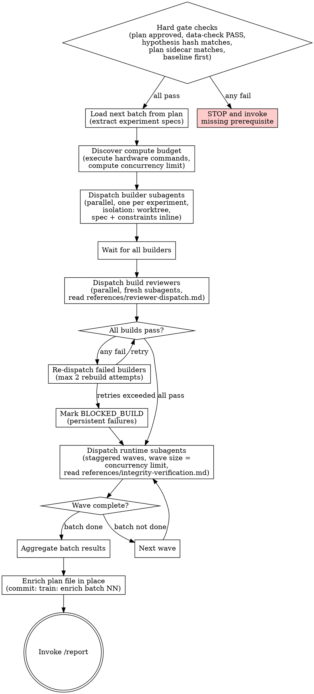

# Train

<HARD-GATE>
Do NOT train without an approved experiment plan. The plan file must exist at the declared path, carry a human approval date, and every experiment must contain a mathematical hypothesis, module layout, and parent reference. Missing or incomplete plan → STOP and invoke design-experiments.
</HARD-GATE>

<HARD-GATE>
Do NOT train without a data-check PASS report. If no PASS report exists, STOP and invoke data-check. The plan cannot be executed against unvalidated data.
</HARD-GATE>

<HARD-GATE>
Do NOT train if the hypothesis integrity-block SHA-256 does not match the hash recorded in the plan. A mismatch means the hypothesis was edited after the plan was written. The integrity contract is broken. STOP and surface the mismatch to the human. Do NOT proceed under any circumstance.
</HARD-GATE>

<HARD-GATE>
Do NOT train if the plan sidecar at `<plan>.sha256` does not match a freshly recomputed SHA-256 over the plan's integrity block (byte range strictly between `<!-- integrity-block:start -->` and `<!-- integrity-block:end -->`, exclusive). A mismatch means the plan's integrity block — hypothesis path, hypothesis hash, baseline ID, batch count, human approval date, plan schema version — was edited after human approval. The tamper-evidence contract is broken. STOP and surface the mismatch to the human. Do NOT proceed under any circumstance.
</HARD-GATE>

<HARD-GATE>
Do NOT train if the first experiment in the first batch is not a baseline. Not a baseline → STOP and return control to design-experiments. The baseline anchors every comparison that follows; without it, every result is meaningless.
</HARD-GATE>

<HARD-GATE>
Do NOT train if the project directory is not a git repository. Builder isolation uses git worktrees, and git worktrees require a git repo. Run `git rev-parse --git-dir` first; if it fails, STOP and ask the human whether to run `git init` with an initial commit of the current state, or re-run from a directory inside an existing repo. Do NOT fall back to plain directories — structural isolation is non-negotiable.
</HARD-GATE>

## Core Principle

Train executes the plan and reports facts. It never interprets metrics, never approves its own work, never merges winners.

## Anti-Pattern

**"The metrics obviously improved, I can skip the review"** — every experiment goes through build review before Runtime, and every experiment hands off to /report before any keep or discard decision. Train never reads a number and decides. Eyeballing is a failure mode, not a shortcut.

## Three-Phase Architecture

Train is strictly phased: Build → Runtime → Handoff. A phase does not start until every experiment in the previous phase has returned.

## Process Flow

## Checklist

Complete these steps in order.

1. Verify hard gates
2. Load the next unstarted batch from the experiment plan
3. Discover compute budget and compute concurrency limit
4. Dispatch builder subagents in parallel (one message, one Task call per experiment, each with `isolation: "worktree"`)
5. Wait for all builders to return
6. Dispatch build reviewer subagents in parallel
7. Wait for all build reviewers
8. Re-dispatch failed builders up to twice; mark BLOCKED_BUILD on persistent failure
9. Dispatch runtime subagents in staggered waves sized to the concurrency limit
10. After each wave returns, start the next wave until the batch is complete
11. Aggregate results into a batch results structure
12. Enrich the experiment plan file in place with results per experiment
13. Commit the plan enrichment
14. Invoke /report with the path to the enriched plan

## Step Details

### 1. Verify Hard Gates

Compute the hypothesis integrity-block SHA-256 and compare to the plan's recorded hash. Compute the plan integrity-block SHA-256 (bytes strictly between `<!-- integrity-block:start -->` and `<!-- integrity-block:end -->`) and compare to `<plan>.sha256`. Confirm the first experiment in batch 1 is a baseline. Confirm the plan file, plan sidecar, data-check PASS report, and hypothesis file are readable.

### 2. Load Next Batch

Read the plan. Find the first batch with no Results section. Extract the specs for every experiment in that batch. Each spec must already carry a mathematical hypothesis, architecture, module layout, parent reference, config diff from parent, success criterion, and failure criterion. An incomplete spec is a plan failure — STOP and return control to design-experiments. Do not invent missing fields.

### 3. Discover Compute Budget

Execute hardware discovery commands. Do not hallucinate specs. Record GPU count, VRAM per GPU, total RAM, CPU count, and the Python, PyTorch, and CUDA versions. Compute the concurrency limit per experiment class: GPU-bound experiments are limited by GPU count; CPU-bound experiments are limited by a computed fraction of CPU count. Freeze the concurrency limit for the entire batch. The limit cannot be raised mid-batch.

### 4. Dispatch Builders in Parallel

Read `references/reviewer-dispatch.md` before dispatching. Every builder Task call emits inside a single assistant message — one message, one call per experiment. Each builder receives `isolation: "worktree"`. The experiment spec and the locked integrity constraints block pass inline in the prompt. Never tell a builder to read the plan file.

### 5. Wait for Builders

Do not act on partial results. Do not dispatch build reviewers until every builder has returned. Treat a BLOCKED return as returned.

### 6. Dispatch Build Reviewers in Parallel

Build reviewers are fresh subagents with no inheritance from the builder. Each reviewer receives the experiment spec and the worktree path. The reviewer validates modular layout, constraint compliance, and craftsmanship per `references/build-craftsmanship.md`. Structural distrust applies — the builder's BUILD_REPORT claims are not trusted until the reviewer confirms them against the actual files.

### 7. Handle Review Verdicts

PASS joins the runnable manifest. FAIL triggers a re-dispatch of the same builder with the specific failures listed in the prompt. Maximum two rebuild attempts per experiment. A third failure marks BLOCKED_BUILD and excludes the experiment from Runtime for this batch. Runtime dispatch proceeds with the remaining build-passed worktrees.

### 8. Dispatch Runtime in Staggered Waves

Read `references/integrity-verification.md` before dispatching. The runnable manifest divides into waves of size equal to the frozen concurrency limit. Dispatch every subagent in a wave inside one message. Wait for the full wave to return before dispatching the next wave. Never exceed the concurrency limit, even for a single straggler.

### 9. Aggregate and Enrich

Collect runtime payloads. Each experiment gains a Results section with status, metrics blob (only on DONE), `trainable_params` (integer recorded by the builder and verified by the build reviewer against the architecture bound), wall-clock seconds, worktree absolute path, log absolute path, constraint hash verification result, build reviewer verdict, and a one-paragraph BUILD_REPORT summary. Commit the enrichment with message `train: enrich batch NN results`.

### 10. Invoke /report

Pass the enriched plan absolute path to /report. Train terminates immediately after the invocation. The next batch requires a fresh train invocation.

## Subagent Contracts

### Builder Subagent

**Input (inline, never via file reading):**
- Single experiment spec with architecture and module layout
- Locked integrity constraints block with its SHA-256
- Parent worktree path (absent for baselines). Builders never read across worktrees. The controller resolves the parent's effective `config.py` by walking the parent chain in the plan and passes the fully-resolved config inline in this dispatch message.
- Fully-resolved parent config (inline JSON-serialized contents of the effective `config.py` for the parent chain; absent for baselines)
- Assigned worktree path

**Required output artifacts in the worktree:**
- `data.py` — loads the locked splits, enforces the feature whitelist, asserts train/val/test set-disjointness
- `model.py` — architecture only
- `train.py` — training loop only
- `eval.py` — metric computation only, emits the locked metric names to the declared path
- `config.py` — typed config, every hyperparameter
- `preflight.py` — pre-flight gate in the exact order from `references/integrity-verification.md`
- `run.sh` — entry point that runs preflight and then training
- `metrics_manifest.json` — exact metric names, output path, mechanical extraction command
- `constraints.lock` — byte-copy of the hypothesis integrity block with its SHA-256
- `BUILD_REPORT.md` — what was built, module by module, zero deviations on PASS. Declares `trainable_params: <int>` as an explicit machine-readable field, computed by instantiating the model under `config.py` and calling the framework's parameter-count API (e.g., `sum(p.numel() for p in model.parameters() if p.requires_grad)` in PyTorch). No config-derived estimates.

**Forbidden actions:**
- Deviating from the spec's architecture
- Adding features not in the declared whitelist
- Swallowing errors with bare try/except or `.get()` defaults
- Writing magic numbers outside `config.py`
- Emitting metric names not in the locked manifest
- Editing the parent worktree

**Status returns:** DONE / DONE_WITH_CONCERNS / NEEDS_CONTEXT / BLOCKED.

### Build Reviewer Subagent

Fresh subagent per experiment. Full checks, input, and status returns live in `references/build-craftsmanship.md` under *Reviewer Enforcement*. Reviewer returns DONE or BLOCKED — no soft pass.

### Runtime Subagent

Full input, step order, forbidden actions, and status vocabulary live in `references/integrity-verification.md` under *Runtime Subagent Contract*.

## Integrity Enforcement

Four mechanical enforcement points run every batch, every experiment: train's gate check (hypothesis hash + plan sidecar), builder output (`constraints.lock` byte-match), preflight order, post-run tamper manifest. Full specification in `references/integrity-verification.md` under *Four Train-Level Enforcement Points*.

## Resource Budget and Wave Dispatch

Hardware discovery is mandatory and never hallucinated. Discovery commands execute at batch start. The discovered environment is recorded in the plan's Results section. The concurrency limit is computed from discovered values and frozen for the batch.

GPU-bound experiments are limited by GPU count. CPU-bound experiments are limited by a computed fraction of CPU count. Mixed batches run two concurrency pools with independent limits.

Full dispatch rules: `references/reviewer-dispatch.md`.

## Worktree Lifecycle

Worktrees live at `.model-trainer/worktrees/<batch-NN>/<exp-id>/` inside the project directory. They persist across batches. Train never deletes worktrees. Cleanup is a human decision made after the full plan completes. Worktree paths are written as absolute references in the enriched plan file.

## Plan Enrichment

After Runtime completes, results write back into the experiment plan file in place. Each experiment entry gains a `## Results` subsection containing:

- `status` — one value from the status vocabulary
- `metrics` — the metrics blob (present only when status is DONE)
- `trainable_params` — integer, the exact trainable-parameter count recorded by the builder and verified by the build reviewer. Required whenever the build reviewer verdict is PASS. Absent only when the experiment never reached Runtime (BLOCKED_BUILD).
- `wall_clock_seconds` — integer seconds
- `worktree_path` — absolute path
- `log_path` — absolute path
- `constraint_hash_verification` — PASS or FAIL
- `build_reviewer_verdict` — PASS or BLOCKED
- `build_report_summary` — one paragraph

No sidecar JSON. The plan is the log. Commit with message `train: enrich batch NN results`.

## Handoff to /report

Train invokes `/report` with the path to the enriched plan file. Train passes no interpretation, no keep or discard recommendation, no verdict. /report is responsible for dispatching review-metrics and review-strategy per experiment, producing the human-readable batch review, recommending winners, surfacing tamper flags and BLOCKED experiments, running winner replication when needed, and merging winners to the experiments branch after human approval.

Train terminates after invoking /report; it does not wait and does not start the next batch.

## Gate Functions

- BEFORE running train: "Does an approved plan exist with a human approval date? Does data-check PASS exist? Does the hypothesis integrity hash match the plan's recorded hash? Does the plan's integrity-block SHA-256 match `<plan>.sha256`?"
- BEFORE dispatching builders: "Am I emitting all Task calls in a single message, or am I about to serialize them?"
- BEFORE each builder: "Did I pass the full spec inline, or am I telling the subagent to read a file?"
- BEFORE starting Runtime: "Did I execute hardware discovery, and is the concurrency limit frozen for this batch?"
- BEFORE each runtime subagent: "Is it pointed at a build-passed worktree with a verified `constraints.lock`?"
- BEFORE advancing a wave: "Has every subagent in the current wave returned?"
- BEFORE aggregating: "Am I about to interpret metrics, or am I only recording them?"
- BEFORE invoking /report: "Have I enriched the plan in place and committed it?"
- BEFORE assuming anything about hardware, metrics, or pass/fail: "Did I execute the command, or am I eyeballing?"

## Rationalization Table

| You think... | Reality |
|---|---|
| "The metrics obviously improved, I can skip /report" | Train does not decide keep or discard. Invoke /report. |
| "This experiment will never tamper, I can skip the hash check" | Tamper checks are mechanical. Run them every time. |
| "Dispatching builders one by one is clearer" | That serializes the parallelism you paid the worktree cost for. One message, all calls. |
| "The subagent can just read the plan file" | Never. Pass the spec inline. File reading pollutes context. |
| "Two workers are fine on one GPU, they'll share" | They will OOM or thrash. Concurrency is computed, not guessed. |
| "The builder knows better than the spec" | The spec is the brief. The builder implements it. Deviations are failures. |
| "I can retry the runtime subagent, the crash was flaky" | Runtime has zero retries. Log the crash, move on. |
| "I'll clean up the worktrees to save disk" | Train never deletes worktrees. Audit trail is not optional. |
| "I can start the next batch now" | Next batch starts after /report and human approval. Train terminates here. |
| "The hypothesis hash mismatch is probably just a typo" | Mismatch means the integrity contract is broken. STOP. |

## Red Flags

- Dispatching subagents in sequential messages instead of a single parallel message
- Telling a subagent to "read the plan file"
- Skipping build review because the spec "looks fine"
- Running a runtime subagent against a build-failed worktree
- Exceeding the frozen concurrency limit "just for this wave"
- Interpreting metrics in the aggregation step
- Deleting worktrees during the batch
- Writing results to a sidecar JSON instead of the plan file
- Looping to the next batch without invoking /report
- Claiming a hardware spec without executing the discovery command
- Retry on runtime crash
- "Graceful degradation" on any failure

## Status Vocabulary

BLOCKED_TAMPER halts the entire batch. All other BLOCKED and CRASHED statuses are experiment-scoped and do not stop the batch.

- DONE — experiment completed, metrics extracted, integrity verified end to end
- DONE_WITH_CONCERNS — completed but flagged for human review when wall-clock is near the timeout or the log contains warning lines
- BLOCKED_BUILD — builder or build reviewer failed persistently; experiment excluded from Runtime
- BLOCKED_PREFLIGHT — `preflight.py` returned non-zero
- BLOCKED_TAMPER — constraint hash drift detected; halts the batch
- CRASHED — `run.sh` returned non-zero
- CRASHED_TIMEOUT — wall-clock kill
- CRASHED_OOM — OOM detected in the log
- CRASHED_NO_METRICS — run completed but the metric extraction command found nothing
- NEEDS_CONTEXT — subagent returned requesting more context; re-dispatch with added context

## The Bottom Line

Write and execute a verification script that checks: the plan file exists and has a human approval date, a data-check PASS report exists, the hypothesis integrity hash matches the plan's recorded hash, the plan integrity-block SHA-256 matches `<plan>.sha256`, the first experiment in batch 1 is a baseline, hardware discovery was executed for the current batch, the concurrency limit is frozen, every build-PASS worktree has a byte-identical `constraints.lock`, every runtime payload carries a status from the declared vocabulary, no experiment was dispatched to Runtime from a build-FAIL worktree, the plan enrichment commit exists, and `/report` was invoked with the enriched plan path. Print `TRAIN BATCH COMPLETE` or `TRAIN BATCH INCOMPLETE` with the specific failing check.
